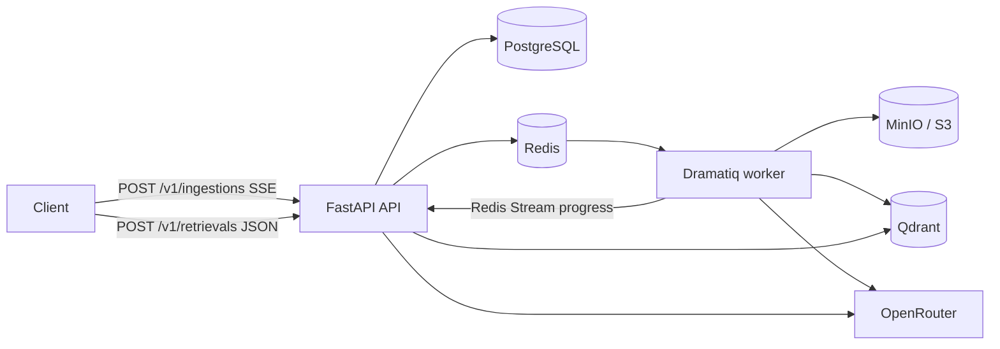

# System context — v0.1.0

## Decisions

- The public RAG API exposes two business routes only.
- Ingestion is executed by a Redis-backed Dramatiq worker and events are replayed from Redis Streams.
- PostgreSQL is the durable job/document registry; Qdrant owns vectors; S3-compatible storage owns raw sources.

## Compatibility

This initial version has no public authentication. It must run behind private network controls until a future major/minor architecture document introduces API-key tenant isolation.
