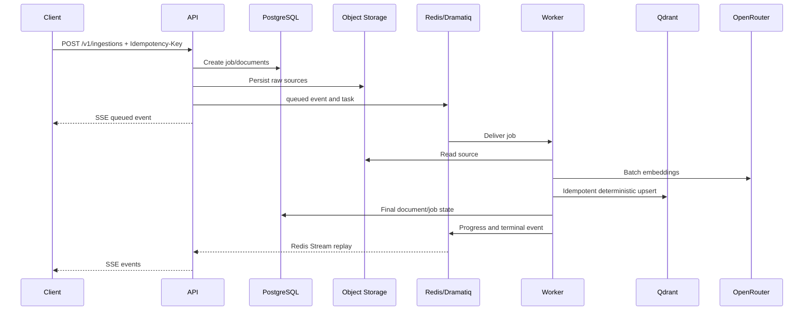
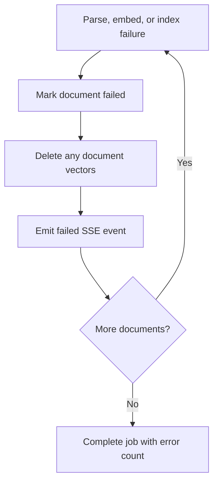

# Ingestion pipeline — v0.2.0

## Change

The initial context design is implemented as a durable asynchronous workflow. Raw sources, database records, vectors, and progress telemetry have separate ownership boundaries.

## Failure behavior

The worker is idempotent: chunk IDs derive from document ID and index, so retried upserts replace rather than duplicate vectors.
