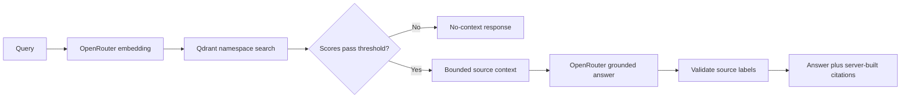

# Retrieval flow — v0.3.0

## Change

Retrieval is implemented as a namespace-filtered Qdrant search plus an OpenRouter grounded-answer call. The API constructs citations from retrieved records; generated citation references are validated before response.

## Compatibility

Changing the embedding model dimension requires a new Qdrant collection/reindex operation; startup intentionally rejects an incompatible existing collection.
