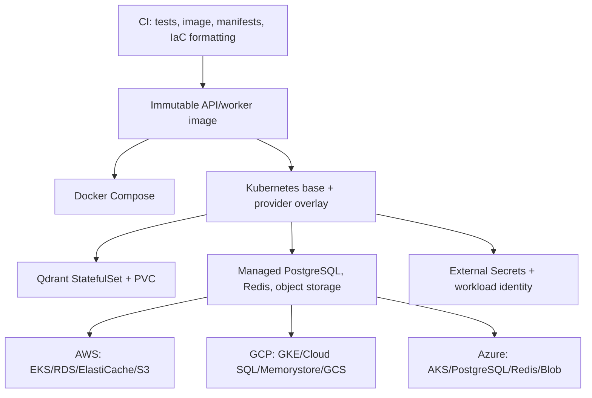

# Deployment topology — v1.0.0

## Change

Docker Compose, Kubernetes Kustomize overlays, and provider-specific Terraform roots are available. Cloud provisioning is manually approved; CI validates syntax and rendered manifests only.

## Deployment checklist

1. Create an encrypted, access-restricted remote Terraform state backend.
2. Apply exactly one cloud root with approved credentials and budget controls.
3. Populate the cloud secret manager outside Terraform state.
4. Replace the overlay workload-identity placeholder with Terraform output and deploy migrations before API/worker workloads.
5. Run private health, ingestion, and retrieval smoke tests before routing user traffic.
